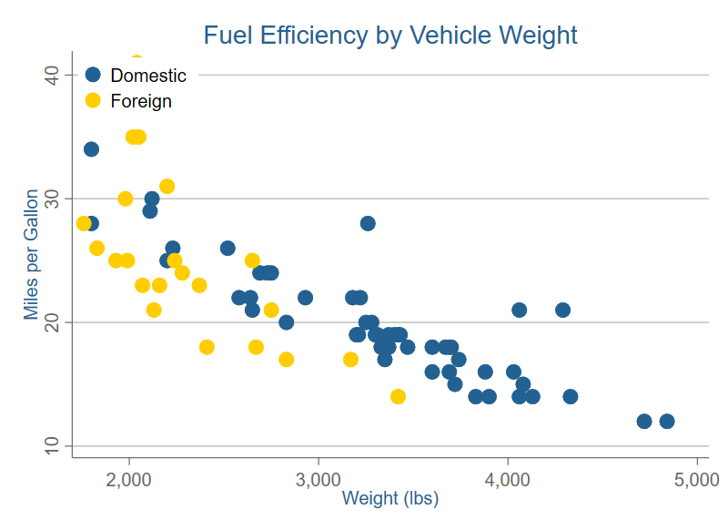

## Installation

Install the UAF graph scheme in Stata:

```stata
net install uaf, from("https://raw.githubusercontent.com/rdazadda/UAF-color-scheme/main/")
```

Or manually copy `scheme-uaf.scheme` to your Stata ado folder:

- Windows: `C:\ado\plus\s\`
- Mac: `~/Library/Application Support/Stata/ado/plus/s/`
- Linux: `~/ado/plus/s/`

## Basic Usage

Set the scheme for your session:

```stata
set scheme uaf
```

Or set it permanently:

```stata
set scheme uaf, permanently
```

## Examples

### Scatter Plot

```stata
sysuse auto, clear
scatter mpg weight, title("Scatter Plot")
```



### Bar Chart

```stata
graph bar (mean) mpg, over(foreign) title("Bar Chart")
```


### Histogram

```stata
histogram mpg, title("Histogram")
```


### Box Plot

```stata
graph box mpg, over(rep78) title("Box Plot")
```


### Multiple Series

```stata
twoway (scatter mpg weight if foreign==0) ///
       (scatter mpg weight if foreign==1), ///
       legend(label(1 "Domestic") label(2 "Foreign")) ///
       title("Multiple Series")
```


## Scheme Colors

| Color | RGB |
|-------|-----|
| Blue | 35 97 146 |
| Gold | 255 205 0 |
| Green | 113 152 74 |
| Orange | 223 106 46 |
| Cyan | 135 209 230 |
| Magenta | 244 81 151 |
| Dark Blue | 17 28 78 |
| Brown | 119 77 40 |
| Dark Grey | 101 102 93 |
| Custard | 246 223 164 |
| Light Blue | 196 207 218 |
| Light Grey | 200 200 200 |

## Features

- White background
- Horizontal grid lines
- Clean, professional appearance
